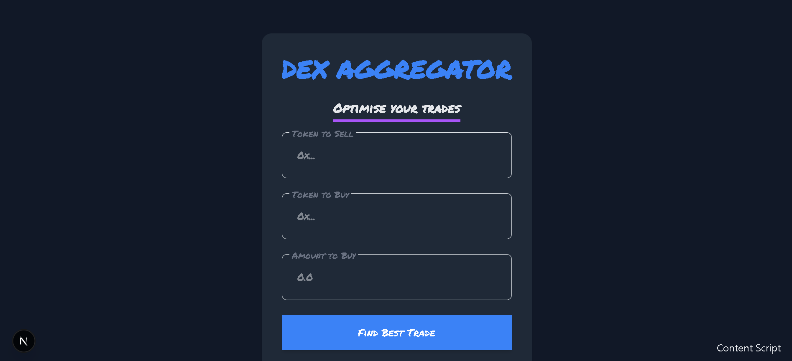

# DEX Aggregator

A modern, decentralized exchange (DEX) aggregator built with Next.js and Ethers.js to optimize your trades across multiple DEXes. This application connects to your Ethereum wallet (via MetaMask), searches for the best trade routes, and executes token swaps with a sleek, user-friendly interface.

  

## Features

- **Wallet Integration**: Connect seamlessly with MetaMask to sign transactions.
- **Trade Optimization**: Aggregates quotes from multiple DEXes to find the best trade with minimal input amount.
- **Modern UI**: Clean, responsive design with light/dark mode support, smooth animations, and intuitive forms.
- **Slippage Protection**: Configurable slippage tolerance (default: 10%) to ensure safe trades.
- **Real-Time Feedback**: Displays processing status, success messages, and error handling for a smooth user experience.
- **Blockchain Interaction**: Uses Ethers.js to interact with smart contracts and execute swaps.

## Tech Stack

- **Framework**: [Next.js](https://nextjs.org/) - React framework for server-side rendering and static site generation.
- **Blockchain**: [Ethers.js](https://docs.ethers.io/) - Library for interacting with Ethereum smart contracts.
- **Styling**: [Tailwind CSS](https://tailwindcss.com/) - Utility-first CSS framework, with custom styles.
- **Fonts**: [Montserrat](https://fonts.google.com/specimen/Montserrat) for body text, [Permanent Marker](https://fonts.google.com/specimen/Permanent+Marker) for headings.
- **Dependencies**: Bootstrap (for basic components), Next.js Font Optimization.

## Prerequisites

Before you begin, ensure you have the following installed:

- [Node.js](https://nodejs.org/) (v16 or higher)
- [npm](https://www.npmjs.com/) or [yarn](https://yarnpkg.com/) (package manager)
- [MetaMask](https://metamask.io/) browser extension (for wallet connectivity)
- An Ethereum testnet (e.g., Sepolia) or mainnet account with some ETH and tokens for testing.

## Getting Started

Follow these steps to set up and run the project locally:

1. **Clone the Repository**
   ```bash
   git clone https://github.com/your-username/dex-aggregator.git
   cd dex-aggregator
   ```
2. **Install Dependencies**
   ```bash
   npm install
   ```
3. **Configure Blockchain Data**  
    {
   "dexes": [
   { "name": "DEX1", "address": "0x...", "dexAbi": [...] },
   { "name": "DEX2", "address": "0x...", "dexAbi": [...] }
   ],
   "erc20ABI": [...]
   }
4. **Run the Development Server**

```bash
npm run dev
# or
yarn dev
```

Open http://localhost:3000 in your browser to see the app.

License
This project is licensed under the MIT License. See the  file for details.
